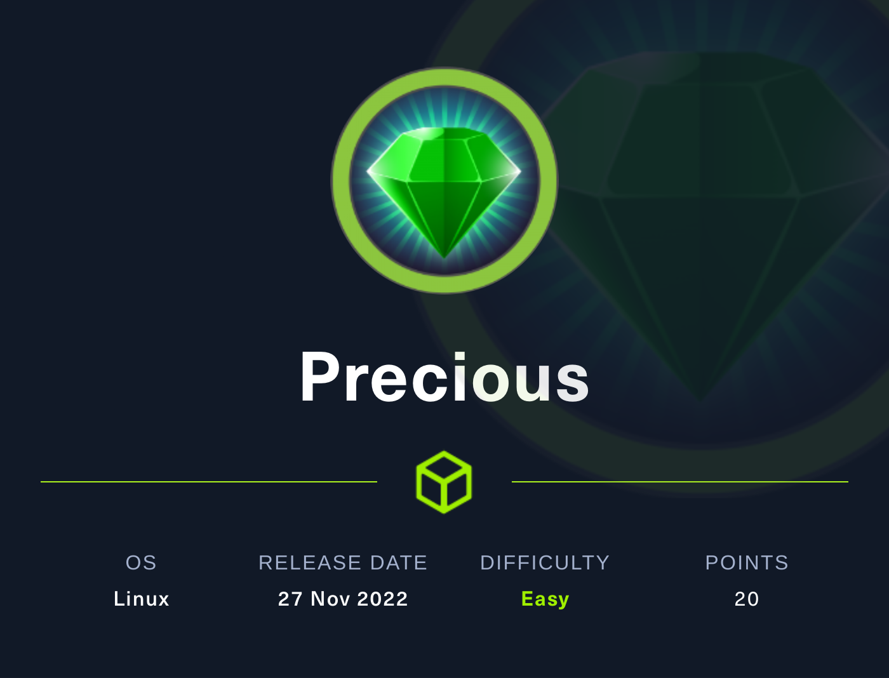

### Hackthebox released a new machine called precious. On this machine, first we got the web service which converts the web-page to a PDF, which is vulnerable to command injection. Using that, get the rev shell, and for privilege escalation, use code execution through yaml deserialization attack. <br>

The IP of this machine is 10.129.166.100 <br>
<p align="center">
	
</p>
##Enumeration

###Nmap Scan
I started my enumeration with an nmap scan of `10.129.166.100` . <br> 
The NMAP command which I always use to scan is `nmap -T4 -A 10.129.166.100` <br>
From the above Nmap Scan I got this output :
```text
Starting Nmap 7.92 ( https://nmap.org ) at 2022-11-29 06:43 IST
Nmap scan report for precious.htb (10.129.166.100)
Host is up (0.24s latency).
Not shown: 998 closed tcp ports (reset)
PORT   STATE SERVICE VERSION
22/tcp open  ssh     OpenSSH 8.4p1 Debian 5+deb11u1 (protocol 2.0)
| ssh-hostkey: 
|   3072 84:5e:13:a8:e3:1e:20:66:1d:23:55:50:f6:30:47:d2 (RSA)
|   256 a2:ef:7b:96:65:ce:41:61:c4:67:ee:4e:96:c7:c8:92 (ECDSA)
|_  256 33:05:3d:cd:7a:b7:98:45:82:39:e7:ae:3c:91:a6:58 (ED25519)
80/tcp open  http    nginx 1.18.0
|_http-title: Convert Web Page to PDF
| http-server-header: 
|   nginx/1.18.0
|_  nginx/1.18.0 + Phusion Passenger(R) 6.0.15
No exact OS matches for host (If you know what OS is running on it, see https://nmap.org/submit/ ).
Nmap done: 1 IP address (1 host up) scanned in 75.33 seconds

```
As always most of the time only two ports were open i.e. `22` and `80`
<br>
